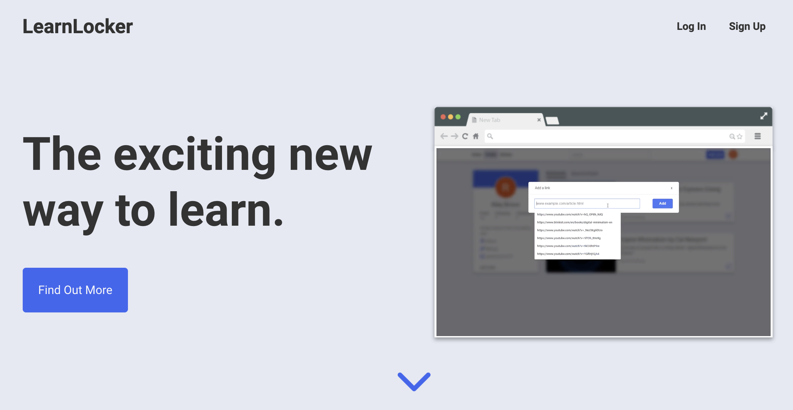

# LearnLocker 

**[locker.dev (formerly LearnLocker](https://learnlocker.dev/)** is an application that reduces your time searching through scattered resources all over the internet by keeping all of it in one place.

## Table of Contents
- [Team](#team)

## Team
 |                                            [**Sumayyah Asgar**](https://github.com/sumi419)                                            |                                         [**Jasmine Galang**](https://github.com/jsmnglng)                                         |                                           [**Riley Brown**](https://github.com/Riley-Brown)                                            |                                              [**Luis Martinez**](https://github.com/luiscmartinez)                                               |                                           [**Samuel Ko**](https://github.com/samsisle)                                            |                                                        [**Cesar Mejia**](https://github.com/cesarnml)                                                        |
| :------------------------------------------------------------------------------------------------------------------------------------: | :-------------------------------------------------------------------------------------------------------------------------------: | :------------------------------------------------------------------------------------------------------------------------------------: | :----------------------------------------------------------------------------------------------------------------------------------------------: | :-------------------------------------------------------------------------------------------------------------------------------: | :----------------------------------------------------------------------------------------------------------------------------------------------------------: |
|                             |                       |                         |                                 |                       |                                             |
|                       [ Github](https://github.com/sumi419)                       |                    [ Github](https://github.com/jsmnglng)                    |                     [ Github](https://github.com/Riley-Brown)                     |                         [ Github](https://github.com/luiscmartinez)                         |                    [ Github](https://github.com/samsisle)                    |                                 [ Github](https://github.com/cesarnml)                                  |
| [  LinkedIn](https://www.linkedin.com/in/sumayyahasgar/) | [  LinkedIn](https://www.linkedin.com/in/jsmnglng/) | [  LinkedIn](https://www.linkedin.com/in/riley-brown96/) | [  LinkedIn](https://www.linkedin.com/in/luis-martinez-11725617a/) | [  LinkedIn](https://www.linkedin.com/in/samsisle/) | [  LinkedIn](https://www.linkedin.com/in/cesar-napoleon-mejia-leiva-46424055/) |

